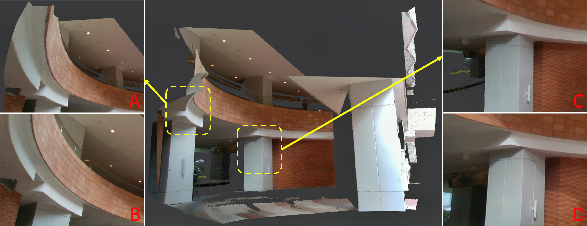
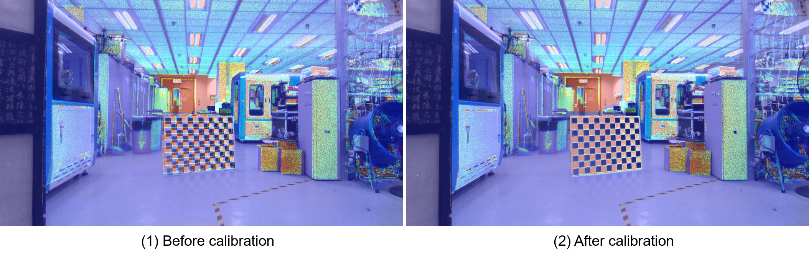

# lidar_camera_calib
**lidar_camera_calib** is a robust, high accuracy extrinsic calibration tool between high resolution LiDAR (e.g. Livox) and camera in targetless environment. Our algorithm can run in both indoor and outdoor scenes, and only requires edge information in the scene. If the scene is suitable, we can achieve pixel-level accuracy similar to or even beyond the target based method.
<div align="center">
    
    <font color=#a0a0a0 size=2>An example of a outdoor calibration scenario. We color the point cloud with the calibrated extrinsic and compare with actual image. A and C are locally enlarged
views of the point cloud. B and D are parts of the camera image
corresponding to point cloud in A and C.</font>
</div>

## Info
New features:
1. Support muti-scenes calibration (more accurate and robust)

## Related paper
Related paper available on arxiv:  
[Pixel-level Extrinsic Self Calibration of High Resolution LiDAR and Camera in Targetless Environments](http://arxiv.org/abs/2103.01627)
## Related video
Related video: https://youtu.be/e6Vkkasc4JI

## 1. Prerequisites
### 1.1 **Ubuntu** and **ROS**
Ubuntu 64-bit 16.04 or 18.04.
ROS Kinetic or Melodic. [ROS Installation](http://wiki.ros.org/ROS/Installation) and its additional ROS pacakge:

```
    sudo apt-get install ros-XXX-cv-bridge ros-xxx-pcl-conversions
```

### 1.2 **Eigen**
Follow [Eigen Installation](http://eigen.tuxfamily.org/index.php?title=Main_Page)

### 1.3 **Ceres Solver**
Follow [Ceres Installation](http://ceres-solver.org/installation.html).

### 1.4 **PCL**
Follow [PCL Installation](http://www.pointclouds.org/downloads/linux.html). (Our code is tested with PCL1.7)

## 2. Build
Clone the repository and catkin_make:

```
cd ~/catkin_ws/src
git clone https://github.com/hku-mars/livox_camera_calib.git
cd ../
catkin_make
source ~/catkin_ws/devel/setup.bash
```

## 3. Run our example
The exmaple dataset can be download from [**OneDrive**](https://connecthkuhk-my.sharepoint.com/:f:/g/personal/ycj1_connect_hku_hk/EuZs1x2RHbxFikjsvt9qf80BD8Wjj05ZhVGRgzfzLCQUCQ?e=un8r1y) and [**BaiduNetDisk(百度网盘)**](https://pan.baidu.com/s/1oz3unqsmDnFvBExY5fiBJQ?pwd=i964)
### 3.1 Single scene calibration
Download [Our pcd and iamge file](https://connecthkuhk-my.sharepoint.com/:f:/g/personal/ycj1_connect_hku_hk/EsPKJ-If659EkzSgApVmGToBLQdxo61p6SG8EEruR6C9Hw?e=beoUXX) to your local path, and then change the file path in **calib.yaml** to your data path. Then directly run
```
roslaunch livox_camera_calib calib.launch
```
You will get the following result. (Sensor suite: Livox Avia + Realsense-D435i)
<div align="center">
    
    <font color=#a0a0a0 size=2>An example of single scene calibration.</font>
</div>

### 3.2 Multi scenes calibration
Download [Our pcd and iamge file](https://connecthkuhk-my.sharepoint.com/:f:/g/personal/ycj1_connect_hku_hk/Ej5-eYv9pJdLj4cOe-qhvO8BaSxFJ0HZU-2savbqHkzvKQ?e=PMjqY6) to your local path, and then change the file path in **multi_calib.yaml** to your data path. Then directly run
```
roslaunch livox_camera_calib multi_calib.launch
```
The projected images obtained by initial extrinsic parameters. (Sensor Suite: Livox Horizon + MVS camera)
<div align="center">
    
    <font color=#a0a0a0 size=2>An example of multi scenes calibration. The projected image obtained by theinitial extrinsic parameters</font>
</div>
Rough calibration is used to deal with the bad extrinsic.
<div align="center">
    
    <font color=#a0a0a0 size=2>The projected image obtained by the extrinsic parameters after rough calibration</font>
</div>
Then we finally get a fine extrinsic after final optimization.
<div align="center">
    
    <font color=#a0a0a0 size=2>The projected image obtained by the extrinsic parameters after fine calibration</font>
</div>

## 4. Run on your own sensor set
### 4.1 Record data
Record the point cloud to pcd files and record image files.
### 4.2 Modify the **calib.yaml**
Change the data path to your local data path.  
Provide the instrinsic matrix and distor coeffs for your camera.

### 4.3 Use multi scenes calibration
Change the params in **multi_calib.yaml**, name the image file and pcd file from 0 to (data_num-1).
